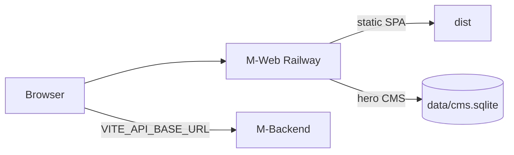

# Railway setup — M-Web (public site)

Deploy the consumer marketing + live results site ([Projectm26/M-Web](https://github.com/Projectm26/M-Web)) on Railway alongside the API and Admin.

## What this service runs

One container:

1. **Vite SPA** (`dist/`) — homepage, charts, `/cms` UI  
2. **Hero CMS** (Hono + SQLite) — `/cms-api/*`, `/cms-media/*`  
3. **Health** — `GET /healthz`

Product data (markets, rates, lottery, APK download) still comes from **M-Backend** via `VITE_API_BASE_URL`.



## Dockerfile

Repo root `Dockerfile` (multi-stage). Builder requires:

```bash
VITE_API_BASE_URL=https://<api>.up.railway.app
```

Leave empty = build fails (no hardcoded API host).

## Deploy steps

1. Railway → New service → GitHub `Projectm26/M-Web` → branch `main`.
2. Builder: **Dockerfile** / path `Dockerfile` (from `railway.toml`).
3. **Variables** — paste [railway.web.env.example](./railway.web.env.example):
   - `VITE_API_BASE_URL` (set **before** first build)
   - `CMS_ACCESS_KEY` (long random)
4. **Volume** → mount **`/app/data`**, replicas **1**.
5. Generate public domain → note `https://<web>.up.railway.app`.
6. On **M-Backend** variables, add that origin to `ALLOWED_ORIGINS` (comma-separated), then redeploy API.
7. Deploy Web. Healthcheck: **`GET /healthz`**.

## Routes

| Path | Purpose |
|---|---|
| `/` | Homepage |
| `/chart` | Charts (SPA) |
| `/cms` | Hero CMS admin UI |
| `/cms-api/public/hero` | Public hero campaigns |
| `/cms-api/*` | CMS admin API (needs `x-cms-key`) |
| `/cms-media/heroes/*` | Uploaded hero images |
| `/healthz` | Liveness |
| `/hero-campaigns.json` | Static fallback if CMS offline |

## Local vs production

| | Local | Railway |
|---|---|---|
| Frontend | `npm run dev` (Vite `:5173`) | Served from `dist/` by CMS process |
| API | Vite proxies `/api` → `VITE_API_PROXY_TARGET` | Browser → `VITE_API_BASE_URL` directly |
| CMS | `npm run dev:cms` (`:8787`) | Same process, `PORT` from Railway |

```bash
cp .env.example .env
npm install
npm run dev:all
```

## After API URL changes

Rebuild/redeploy M-Web so Vite re-bakes `VITE_API_BASE_URL`.
